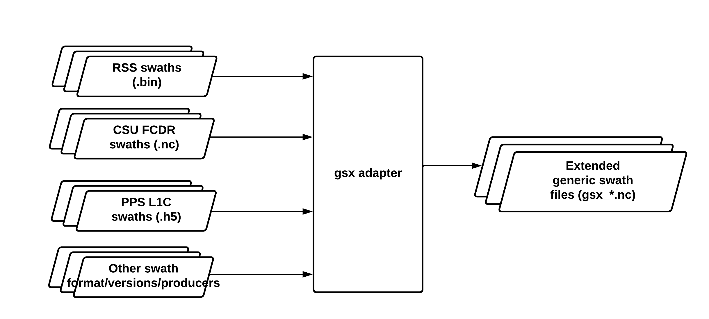

# Passive Microwave Earth Science Data Record (PMESDR) System

<!-- markdown-toc start - Don't edit this section. Run M-x markdown-toc-refresh-toc -->
**Table of Contents**

- [Passive Microwave Earth Science Data Record (PMESDR) System](#passive-microwave-earth-science-data-record-pmesdr-system)
    - [Introduction](#introduction)
    - [License](#license)
    - [Repository Contents](#repository-contents)
    - [Requirements](#requirements)
    - [Installation ](#installation)
    - [Testing](#testing)
        - [Unit Tests](#unit-tests)
        - [Quick Regression](#quick-regression)
        - [Daily Regression](#daily-regression)
    - [Development Cycle](#development-cycle)
        - [Releasing](#releasing)
    - [Software](#software)
        - [gsx](#gsx)
            - [AMSR sensor gsx differences](#amsr-sensor-gsx-differences)
        - [meas_meta_make](#meas_meta_make)
        - [meas_meta_setup](#meas_meta_setup)
        - [meas_meta_sir](#meas_meta_sir)
        - [meas_meta_bgi](#meas_meta_bgi)
        - [Additional software](#additional-software)
            - [C gsx reader module](#c-gsx-reader-module)
            - [calcalcs](#calcalcs)
            - [cetb_file](#cetb_file)
            - [utils](#utils)
    - [Ancillary Data](#ancillary-data)
        - [Region Definition Files](#region-definition-files)
    - [Development Notes](#development-notes)
        - [Annual maintenance on local-time-of-day (ltod) boundaries](#annual-maintenance-on-local-time-of-day-ltod-boundaries)
        - [Adding a New Sensor/Producer](#adding-a-new-sensorproducer)
        - [Changing Spatial Resolution](#changing-spatial-resolution)
        - [Known Issues](#known-issues)
    - [Operational Instructions](#operational-instructions)
    - [Geolocation Tools](#geolocation-tools)
        - [EASE-Grid 2.0 Geolocation Files](#ease-grid-20-geolocation-files)
        - [Software Supporting EASE-Grid 2.0 ](#software-supporting-ease-grid-20)
            - [`cetbtools` python package](#cetbtools-python-package)
            - [`mapx` C library](#mapx-c-library)
            - [Matlab utilities](#matlab-utilities)
            - [Other Software](#other-software)
    - [Data Products](#data-products)
        - [CETB Data Products](#cetb-data-products)
        - [SMAP CETB Data Products](#smap-cetb-data-products)
    - [References](#references)

<!-- markdown-toc end -->

## Introduction

This software repository contains source code to transform passive microwave
radiometer swath-format data to gridded format, using image reconstruction
methods developed by D. G. Long at Brigham Young University. The radiometer
version of Scatterometer Image Reconstruction (rSIR) ([Long and Brodzik,
2016](#long2016); [Long et al., 2019](#long2019); [Long et al.,
2023](#long2023)) leverages large footprint overlaps and irregularly-spaced
sampling locations to enhanced the spatial resolution of the output grids. The
PMESDR system is currently maintained and operated at the National Snow and Ice
Data Center (NSIDC) Distributed Active Archive Center (DAAC) on hardware
resources at the DAAC and at the University of Colorado Research Computing
(CURC) high performance computing facilities in Boulder, CO.

A description of software methods and data set requirements definitions for the
project development is included in [Brodzik et al., 2018](#brodzik2018a). Data
products are produced in EASE-Grid 2.0 ([Brodzik et al., 2012](#brodzik2012);
[2014](#brodzik2014)). This system has been used to produce the following data
products:

Data Product ID | Reference | Algorithm Theoretical Basis Document | Status
--------------- | --------- | ------------------------------------ | ------
nsidc0630v1 | [Brodzik et al., 2016](https://doi.org/10.5067/MEASURES/CRYOSPHERE/NSIDC-0630.001) | [nsidc0630v1 ATBD](https://doi.org/10.5281/zenodo.7958456) | Currently produced at NSIDC
nsidc0630v2 | [Brodzik et al., 2023](https://doi.org/10.5067/19LHYLUXZ22M) | [nsidc0630v2.1 ATBD](https://doi.org/10.5281/zenodo.11626219) | In preparation at NSIDC DAAC
nsidc0763v1 | [Brodzik et al., 2021](https://doi.org/10.5067/NDQ5ATHFSH57) | n/a | Prototype for nsidc0630v2, available for limited periods only
nsidc0738v2 | [Brodzik et al., 2021](https://doi.org/10.5067/YAMX52BXFL10) | [nsidc0738v2 ATBD](https://doi.org/10.5281/zenodo.11069045) | Stopped production late 2023, to be replaced by nsidc0738v3
nsidc0738v3 | [Brodzik et al., 2024](https://doi.org/10.5067/8OULQIU7ZPSX) | [nsidc0738v3 ATBD](https://doi.org/10.5281/zenodo.11069054) | In preparation at NSIDC DAAC


Copyright (C) 2014-2024 The Regents of the University of Colorado and Brigham
Young University.

## License

This project software is licensed under the GNU General Public License v3.0.
Please refer to the LICENSE.txt file for details.

## Repository Contents

This repository contains the following:

Directory | Contents
--------- | --------
CETB_process/ | operational workflows and scripts used to run this system on NSIDC resources at CURC
LICENSE.txt | software license
README.md | this README file
VERSION | ascii file with current release version, updated for major/minor/patch releases, used in output CETB files
docs/ | documentation TBD fix this (combine all refs/reports, move internal notes to README etc
include/ | C header files
ipython_notebooks/ | various ipython notebooks, includes notebook to examine orbital drift for local-time-of-day boundaries
matlab/ | matlab viewer routines
python/ | miscellaneous python utilities
ref/ | region definition files
regression_scripts/ | bash scripts to perform regression testing
sample_data/ | data files for regression and development testing --TBD should this be moved down?
src/ | PMESDR system C source code
testing/ |  directory of testing code and data files --TBD clean this up

## Requirements

The system requires the following:

`python`/`conda`: Python is required to run the extended generic swath utility to convert
various input swath data formats to gsx-formatted .nc files; python is also
required to execute some unit test comparisons and to perform regression
testing; Miniconda is required to build a conda environment; make targets are
included to build the conda environment with gsx and required packages for
running the system

`make`:	The `make` build utility is required to build the C components and run
regression tests.

C compiler: The system builds and has been tested with `gcc` and `icc` compilers
on systems at NSIDC (Ubuntu) and CURC (RedHat).

`netCDF4`/`zlib`: The system requires netCDF4/HDF5 libraries for file IO, and
zlib to enable file compression.

`udunits`: The system requires the Unidata
[`udunits`](https://www.unidata.ucar.edu/software/udunits/) library for handling
standardized units.

`bash`:	Operational scripts are written in the `bash` scripting language.

`ceedling`: For development, the C parts of the system require the C
[`ceedling`](https://github.com/ThrowTheSwitch/Ceedling) system, which is an
extension of the Ruby Rake build system.

## Installation 

Install the the PMESDR system by cloning the repo:

``` bash
git clone git@github.com:nsidc/pmesdr
```

Always start working on the system by setting the system environment variables
expected by scripts and Makefiles:

``` bash
cd pmesdr/src/prod
source ./set_pmesdr_environment.sh
```

This script will set required bash environment variables and is sensitive to
hostnames and available compilers on systems available at the University of
Colorado. On the CURC supercomputer, required software and packages will be
loaded. **_Users who need to build the system in a different environment will
need to edit the set_pmesdr_environment.sh script and `src/prod` Makefiles with settings for your local
environment and compiler._**

Download and install
[Miniconda](https://docs.anaconda.com/miniconda/miniconda-install/).

Configure your conda installation channels to include `nsidc` and `conda-forge`:

``` bash
conda config --add channels conda-forge
conda config --add channels nsidc
```

The result from the --show channels command should return (order is important,
as it determines precedence):

``` bash
$ conda config --show channels
channels:
  - nsidc
  - conda-forge
  - defaults
```

Create a conda environment with required python packages, including `gsx`:

``` bash
cd pmesdr/src/prod
source ./set_pmesdr_environment.sh
make conda-env
```

This will create a conda environment named ${PMESDR_CONDAENV} with the required packages to test and run the system.
		
Compile and install the system:
	
``` bash
cd pmesdr/src/prod
source ./set_pmesdr_environment.sh
make clean
make all
make install
```

This will build and install C executables `meas_meta_make`,	`meas_meta_setup`, and `meas_meta_sir` in the bin/ directory.
		
## Testing

Install the regression data repository with:

``` bash
cd pmesdr/src/prod
source ./set_pmesdr_environment.sh
make regression-setup
```

This will clone a git repository with regression data for comparison tests in a
directory named `pmesdr_regression_data` as a sibling to the directory where the
`pmesdr` clone is located. This step only needs to be done once and then again
only if the regression data changes. Data in the repository are organized in
directories by date. The regression date used in the tests is specified by the
value of `regression_yyyymmdd` that is defined in `set_pmesdr_environment.sh`.

The regression tests assume that a conda environment named ${PMESDR_CONDAENV}
has been built as described above. 

### Unit Tests

Limited unit tests are available for some parts of the system. See below for
more rigorous regression test options. To re-build the system C executables and
run unit tests:

``` bash
cd pmesdr/src/prod
source ./set_pmesdr_environment.sh
make unit-test
```


### Quick Regression

A "quick" regression, intended for quick development cycles, is fast, but only
executes tests for the Northern Hemisphere grid and a limited set of pre-defined
gsx inputs. It assumes that you have re-built the executables (make clean; make
all; make install) with whatever changes you may be testing. Run a quick
regression with:

``` bash
cd pmesdr/src/prod
source ./set_pmesdr_environment.sh
make quick-regression
```

This test runs in about a minute on a CURC compute node.

### Daily Regression

A "daily" regression, intended for more rigorous testing, takes longer to run,
and executes tests for the N, S and T (Northern and Southern Hemisphere, and
Temperate Cylindrical Equal-area)  grids and a larger set of pre-defined
gsx inputs. It assumes that you have re-built the executables (make clean; make
all; make install) with whatever changes you may be testing. Run a daily
regression with:

``` bash
cd pmesdr/src/prod
source ./set_pmesdr_environment.sh
make daily-regression
```

This test runs in about five minutes on a CURC compute node. In NSIDC's
installation on CURC, it is
configured to run daily at midnight as part of continuous integration.

## Development Cycle

	1. Create a feature branch
	2. Create and test changes on the feature branch
		* 'make unit-test' to rebuild executables and run unit tests
		* 'make quick-regression' for fast regression
		* 'make daily-regression' for more comprehensive regression
	3. Push commits on the feature branch
	4. Create a Pull Request on GitHub
	5. When the feature PR is merged to the main branch, the patch version and
	tag on the main branch will be incremented

### Releasing

By default, software pushed to the main branch will bump the patch version
only. When major or minor versions need to be bumped, suppress the patch bump
action with:

	1. Checkout the main branch
	2. bumpversion --tag --message "[skip actions] bump version {current_version}->{new_version}" [major|minor] 
	3. git push
	4. git push origin tag v{new_version}

## Software

TBD: PMESDR system nominal workflow 

### gsx

The python package, eXtended generic swath (`gsx`), uses an object-oriented
Adapter design pattern to encapsulate sensor- or producer-specific
idiosyncrasies. Running gsx on any of the accepted swath data files (also
referred to as `Level 1b` or `Level 1c` files) translates the contents into a
generic version of passive microwave swath data with all required metadata and
geolocation for the PMESDR system. With a few notable exceptions, all
differences between input swath files are encapsulated in the `gsx` python
convertor. This design simplifies the PMESDR system modules by removing most
special logic for handling data from new sensors or data producers.

Files formatted as `gsx` are NC-compliant, with required geolocation and
positional metadata in a format that is expected by the [C gsx
reader](#c-gsx-reader) module (below).



#### AMSR sensor gsx differences

For most input swath files, there is a 1-to-1 relationship between the original
swath file and the corresponding gsx file, with the exception of files derived
from the NASA PPS system for AMSR-E and AMSR2 sensors. In these cases, the input
L1C files contain all required metadata and brightness temperatures, except for
the 6 GHz inputs. In order to access 6 GHz TBs, we created a gsx translator to
pull 6 GHz TBs from corresponding JAXA L1B files. The L1B files are organized by
half-orbit and include half-orbit overlaps. For these sensors, the workflow
required to produce complete gsx files containing all channels requires calls to
gsx for the original L1C (all channels but 6 GHz), a call gsx for each potential
corresponding L1B files (for only 6 GHz data), and finally a call to a python
function `gsx-merger` to merge the partial gsx files into a single, complete gsx
file for input to the PMESDR system.

TBD: figure for AMSR-specific gsx workflow

### meas_meta_make

The `meas_meta_make` utility is a command-line C program to compile
configuration files used for downstream processing. It converts information in a
[region definition file](#region-definition-files) into a file that is formatted
for use by the `meas_meta_setup` utility. The usage message can be produced by
calling it with no input arguments:

``` bash
meas_meta_make.c: usage: meas_meta_make [-t threshold] [-r resolution] meta_name platform start_day stop_day year def in_list

 meas_meta_make.c: options:
   meas_meta_make.c: -t threshold = response threshold, dB, default is -8. dB
   meas_meta_make.c: -r resolution flag = 0 (25km) 1 (36 km) 2 (24 km), default is 0 for 25 km base resolution
 meas_meta_make.c: input parameters:
   meas_meta_make.c: meta_name   = meta file output name
   meas_meta_make.c: platform    = name of the platform as cetb_platform_id (from cetb.h)
   meas_meta_make.c: start_day   = start day
   meas_meta_make.c: end_day     = end day
   meas_meta_make.c: year        = year input
   meas_meta_make.c: def         = region def file 
   meas_meta_make.c: in_list     = name of input file containing list of swath files

```

Required inputs:

meta_name: fully-qualified .meta output file name
platform: platform to process
start_day: digits?  TBD
end_day: digits? TBD
year: digits? TBD
def: fully-qualified region definition file

Options:

-t threshold: response threshold to change sensitivity to TBD, default -8. dB;
increasing/decreasing this value will TBD

-r resolution flag: base spatial resolution, used to determine all
higher-resolution grids as powers of 2, e.g. `-r 0` sets base resolution to 25
km, used for 12.5, 6.25 and 3.125 km enhanced-resolutions

Outputs:

For each region definition file, an ascii-formatted `.meta` file is produced for
use by `meas_meta_setup`.

### meas_meta_setup

The `meas_meta_setup` utility is a command-line C program that uses the
configuration parameters defined by `meas_meta_make` to convert gsx input into
`.setup` files required by `meas_meta_sir`. The usage message can be produced by
calling it with no input arguments:

``` bash
usage: meas_meta_setup -b box_size meta_in outpath

 input parameters:
   -b box_size is optional input argument to specify box_size for MRF
      default box_size is 80 for early regression testing
   meta_in     = input meta file
   outpath     = output path

```

Required inputs:

meta_in : fully-qualified .meta file from `meas_meta_make`
outpath : output path for .setup files

Options:

-b box_size: number of pixels that defines measurement response function, as
a square box_size X box_size area of the output grid. MRF for pixels outside the
box_size is defined to be zero. Default 80.

Outputs:

For each region defined in the input `.meta` file, a binary `.setup` file is
produced that contains the mapping of every potential measurement to each output
grid cell.

### meas_meta_sir

The `meas_meta_sir` utility is a command-line C program that uses a `.setup`
file to perform the radiometer version of scatterometer image reconstruction
(rSIR). The usage message can be produced by calling it with no input arguments:

``` bash
usage: ./meas_meta_sir setup_in outpath 

 input parameters:
   setup_in        = input setup file
   outpath         = output path
```

Required inputs:

setup_in : fully-qualified .setup file from `meas_meta_setup`
outpath : output path for reconstructed CETB GRD and rSIR files

Options:

There are no options to this utility.

Outputs:

For each input `.setup` file, two image files are produced: one base-resolution
CETB GRD file and one enhanced-resolution CETB rSIR file. These CETB files are
CF-compliant netCDF4 files.
 
### meas_meta_bgi

The `meas_meta_bgi` utility is a command-line C program that uses a `.setup`
file to perform Backus-Gilbert image reconstruction. This utility is obsolete.
We have determined that it is much more computationally demanding than
`meas_meta_sir`. It was used in early development and testing of the PMESDR
system ([Long and Brodzik, 2016](#long2016); [Long et al., 2019](#long2019)),
and is only included here for historical purposes. It is no longer included in
the build or testing targets.

### Additional software

#### C gsx reader module

The C gsx reader module is a reader for gsx-formatted inputs. It provides a
read-only interface to the contents of a gsx file.

#### calcalcs

The C [`calcalcs`](https://cirrus.ucsd.edu/~pierce/calcalcs/index.html) module
is required for date and calendar conversions. `calcalcs` is distributed under the
GNU GPL and is included with the PMESDR system, having been modified only to
build using the ceedling Rake system alongside the other required utility modules.

#### cetb_file

The C `cetb_file` module is writer for CETB-formatted outputs. The cetb_file
module assumes that the caller has provided a CETB "template" file, with most of
the required general CETB metadata defined prior to run time. The cetb_file
methods determine the specific metadata to use and set the remaining output
metadata at run-time. The python notebook, `ipython_notebooks/Create CETB file template.ipynb`, is used to create and/or modify CETB template files, which are
saved in the `src/prod/cetb_file/templates/` directory.

#### utils

The C `utils` module is a collection of small methods defined as system
utilities, including memory allocation routines and several small routines for
handling gridded data geometry.

## Ancillary Data

### Region Definition Files

Required by `meas_meta_make`, stored in the `ref/` directory.  These files
control the processing configuration for a requested batch of processing.

`regiondef1.dat` is the general region definition file, containing region ids
for many regions used in historical development at BYU. The regions ids used for
CETB data products are only EASE2_M (typo here), EASE2_N, EASE2_S and EASE2_T
(305, 308, 309, 310).

Format of .def files is:

* Line 1: the number of regions defined in the file: note that in this context a
      region is the combination of a projection, projection scale and
      channel id. For example, if you have 5 channels and you wish to process
      each channel for EASE2N and separate into ltod images, you will create 10
      regions.
* Groups of 5 lines (1 per region): 5 ordered lines per region. If the first line is 2
      (for 2 regions), there will be 10 more lines in the file defining each of
      those 2 regions.
  * the lines defining each region are:
	* region id
    * resolution factor
    * asc/des/ltod flag
    * beam number
    * SIR iterations

Region Field | Values | Notes
------------ | ------ | -----
region id    | 305, 308, 309, 310 | corresponding to EASE2-M, etc, see `regiondef1.dat`
resolution factor | 0, 1, 2, 3    | power of 2 divided into base resolution
asc/des/ltod flag | 0=all, 1=asc, 2=des, 3=morn, 4=eve |
beam number | 1=19H, 2=19V, 3=22V, 4=37H, 5=37V, 6=85H, 7=85V | these are for SSM/I -- where are these defined for AMSR2, etc?
SIR iterations | number | number of SIR iterations for this channel

`resolution factor`: Note that resolution factor is used together with meas_meta_make -r
base_resolution option to determine output spatial resolution. For examples,
with -r 25, setting factor 0 = 25/(2**0) = 25 km, factor 1 = 25/(2**1) = 12.5 km,
factor 2 = 25/(2**2) = 6.25 km, factor 3 = 25/(2**3) = 3.125 km.

`SIR iterations`: Please refer to detailed discussions in [Long,
2015](#long2015) for optimal number of SIR iterations by sensor and
channel. This value varies by sensor and channel, and controls the tradeoff
between image enhancement and noise. Note that the value of this setting is
saved in CETB output files, in the TB variable attribute,
`sir_number_of_iterations`.

Example files include:

* `EASE2N_test1ch.def`: EASE2-N projection for 1 channel,
separated by local-time-of-day, this is used for the `make quick-regression`
target.
* `E2?_test.def`: For each of N, S, T, all channels, separated by ltod, used for
the `make daily-regression` target.

## Development Notes

### Annual maintenance on local-time-of-day (ltod) boundaries

Boundary settings for local-time-of-day (ltod) settings can vary by sensor,
hemisphere and date. ltod settings control the morning vs. evening binning that
is performed for EASE2-N and EASE2-S projections. Appendices in [Brodzik et
al. 2024](https://doi.org/10.5281/zenodo.11626219) include the history of ltods
shifting due to orbital drift over the lifetimes of the CETB sensors. For
sensors that continue to produce data in near real-time, NSIDC performs annual
maintenance of ltod settings, using the ipython notebook,
`ipython_notebooks/LTOD calculations.ipynb`. Steps to perform annual ltod checks
include:

	1. TBD

### Adding a New Sensor/Producer

Steps to add and process data from a new sensor and/or data producer:

	1. Add or modify one of the gsx Adaptor strategies in `gsx`, to produce`.gsx`-formatted eXtended Generic Swath input files.
	2. Modify `include/cetb.h` with values for new sensor name, platform, NSIDC
	dataset name, channels etc. Most of these will be easy to recognize once the
	new sensor data are examined, e.g. there are enums defined for the platform,
	producer id, etc.
	3. Modify `meas_meta_make` with a new single letter identifier that is used
	in the setup files - see the section in the code that compares F_num to the CETB_platform
	enum (TBD--needs more detail on what actully needs to be modified here)
	4. Edit the function cetb_template_filename in cetb_file.c to get the correct template file for the platform and provider
	combination 

### Changing Spatial Resolution

For CETB data products, the PMESDR system only outputs data in EASE grid 2.0 (N,
S, M, T) projections. 

The default is to produce data at a 25 km base resolution. See [Region
Definition Files](#region-definition-files) to produce output at standard
spatial resolutions that are divisors of the base resolution, at factors of
powers-of-2 (12.5, 6.25, 3.125 km, etc).

The system can also produce data with a base resolution of 36 km
or 24 km.  These are achieved with the `-r` option to `meas_meta_make`:

* -r 0  is the default and uses the 25 km base resolution
* -r 1  uses 36 km base resolution (and hence 18, 9, 4.5, 2.25 etc)
* -r 2  uses 24 km base resolution (and 12, 6 and 3)

Currently this is only used in SMAP processing where, for the CETB SMAP
(nsidc-0738) products, we also produce 36, 9 and 3 km resolution gridded output.
The 24 km output is not used and is discarded, but is required as a base
resolution, to get to 3 km.  Also note that the software ensures for the 24 km
base resolution that the cylindrical grids are M rather than T grids as they
extend to higher latitudes than the T grids (which only extend to +/- 67
degrees).

### Known Issues

1. `meas_meta_setup` assumes time values from gsx file are epoch 1987: Setup
   does all time comparisons using the time variable from the gsx file; however,
   it is assuming epoch time of "seconds since Jan 1 1987", but it should be
   getting this string directly from gsx. The python gsx package should set the
   epoch time so that this assumption and hardcoded epoch can be removed from
   `meas_meta_setup`.

## Operational Instructions

Operational instructions are written for NSIDC operators, for use on CU Research
Computing resources. The instructions assume that operators have access to these
systems and access to swath data provider repositories. Mileage may vary for
non-NSIDC operators. See [nsidc0630 v1
notes](CETB_process/v1_0630_processing_notes.md) or [nsidc0630 v2
notes](CETB_process/v2_0630_processing_notes.md) for operational data production
details.

## Geolocation Tools

The PMESDR system produces data in EASE-Grid 2.0. [Brodzik et al.,
2012](https://doi.org/10.3390/ijgi1010032) and [Brodzik et al.,
2014](https://doi.org/10.3390/ijgi3031154) contain projection and gridding
details, with reference transformations and PROJ.4 strings included in
appendices. Since the publication of this information, EASE-Grid 2.0 EPSG codes
have been defined and verified as:

Projection | EPSG Code
---------- | ---------
North | EPSG:6931
South | EPSG:6932
Global Cylindrical | EPSG:6933

### EASE-Grid 2.0 Geolocation Files

EASE-Grid 2.0 arrays of latitude and longitude positions at the center of each
grid cell are available as [nsidc-0772](https://nsidc.org/data/nsidc-0772/versions/1).

### Software Supporting EASE-Grid 2.0 

For map transformation software and/or to perform transformations at locations
other than the centers of grid cells, users have several options.

#### `cetbtools` python package

The [`cetbtools`](http://anaconda.org/nsidc/cetbtools) python package is
available for linux, mac osx and Windows platforms. Use the conda package
manager to install cetbtools. `cetbtools` contains an `Ease2Transform` class for
calculating transformations between geographic (lat/lon), grid (row/col), and
map (x,y) locations in EASE-Grid 2.0 projections.

The ipython notebook, [How to read and examine CETB
files](https://nbviewer.org/gist/mjbrodzik/a250ff522cb49dc155eb), includes
examples of opening and displaying data in a CETB file, and examples showing how
to understand the projection and grid metadata, the time variable and run the
map transformations from (row,col) <--> (lat, lon). Even if you are not a python
progammer, reviewing this notebook will likely help you understand how the data
in the CETB files are organized.  You only need a browser to view the notebook.

#### `mapx` C library

Originally developed at NSIDC, [`mapx`](https://github.com/nsidc/mapx) is a
public C library with map transformation routines supporting a large set of map
projections, including the EASE-Grid 2.0 projections.

The [`mapxmaps`](https://github.com/nsidc/mapxmaps) repository contains many
grid parameter definitions (`.gpd`) files used by `mapx`. In any given CETB
file, the "long_name" attribute in the "crs" variable contains the name of the
mapx gpd file that corresponds to the data in the file.

`mapx` users may wish to refer to the ipython notebook above in the
[cetbtools python package](#cetbtools-python-package) section, for a link to
view an ipython notebook in your browser to better understand the file contents
and organization.

#### Matlab utilities

The `matlab/` directory in this repository contains Matlab routines that support
reading and displaying CETB files, and map projection forward and reverse
transformations. Instructions for use are included in
`matlab/viewer/readme.txt`.

Matlab users may wish to refer to the ipython notebook above in the
[cetbtools python package](#cetbtools-python-package) section, for a link to
view an ipython notebook in your browser to better understand the file contents
and organization.

#### Other Software

NSIDC maintains an informational web site with the latest known information
about various software packages (HDFEOS, PROJ.4, GDAL, ENVI, mapx, ArcGIS,
ERDAS) [support for EASE-Grid 2.0
projections](https://nsidc.org/data/user-resources/help-center/what-tools-are-compatible-ease-grids).

## Data Products

The PMESDR system has been used to produce the following Calibrated,
Enhanced-Resolution Brightness Temperature (CETB) data sets:

### CETB Data Products

<a id="brodzik2016">Brodzik, M. J., D. G. Long, M. A. Hardman, A. Paget, and R. Armstrong. 2016,
updated current year. MEaSUREs Calibrated Enhanced-Resolution Passive Microwave
Daily EASE-Grid 2.0 Brightness Temperature ESDR, Version 1. Boulder, Colorado
USA. NASA National Snow and Ice Data Center Distributed Active Archive
Center. [nsidc0630](https://nsidc.org/data/nsidc-0630/versions/1)
[10.5067/MEASURES/CRYOSPHERE/NSIDC-0630.001](https://doi.org/10.5067/MEASURES/CRYOSPHERE/NSIDC-0630.001).

<a id="brodzik2021b"></a>Brodzik, M., D. Long, and M. Hardman. 2021. Calibrated
Enhanced-Resolution Passive Microwave Daily EASE-Grid 2.0 Brightness
Temperatures Derived from Level 1C FCDR (1.1). National Snow and Ice
Data Center, Boulder, CO, USA. [10.5067/NDQ5ATHFSH57](https://doi.org/10.5067/NDQ5ATHFSH57).

<a id="brodzik2023a">Brodzik, M. J., D. G. Long, M. A. Hardman. 2023,
updated current year. Calibrated Enhanced-Resolution Passive Microwave
Daily EASE-Grid 2.0 Brightness Temperature ESDR, Version 2. Boulder, Colorado
USA. NASA National Snow and Ice Data Center Distributed Active Archive
Center. [nsidc0630](https://nsidc.org/data/nsidc-0630/versions/2)
[10.5067/19LHYLUXZ22M](https://doi.org/10.5067/19LHYLUXZ22M).

### SMAP CETB Data Products

<a id="brodzik2021">Brodzik, M. J., D. G. Long, M. A. Hardman. 2021, updated 2023. SMAP Radiometer
Twice-Daily rSIR-Enhanced EASE-Grid 2.0 Brightness
Temperatures. Version 2. Boulder, Colorado USA: NASA DAAC at the National Snow
and Ice Data
Center. [nsidc0738v2](https://nsidc.org/data/nsidc-0738/versions/2). [10.5067/YAMX52BXFL10](https://doi.org/10.5067/YAMX52BXFL10).

<a id="brodzik2024">Brodzik, M. J., D. G. Long, M. A. Hardman. 2024, updated current year. SMAP
Radiometer Twice-Daily rSIR-Enhanced EASE-Grid 2.0 Brightness
Temperatures. Version 3. Boulder, Colorado USA: NASA DAAC at the National Snow
and Ice Data Center.
[nsidc0738v3](https://nsidc.org/data/nsidc-0738/versions/3). [10.5067/8OULQIU7ZPSX](https://doi.org/10.5067/8OULQIU7ZPSX).

## References

<a id="brodzik2012">Brodzik, M. J., B. Billingsley, T. Haran, B. Raup, and M. H. Savoie. 2012.
EASE-Grid 2.0: Incremental but Significant Improvements for Earth-Gridded Data
Sets. ISPRS Int. J. Geo-Inf. 1,
32–45. [10.3390ijgi1010032](https://doi.org/10.3390/ijgi1010032).

<a id="brodzik2014">Brodzik, M. J., B. Billingsley, T. Haran, B. Raup, and M. H. Savoie. 2014.
Correction: Brodzik, M.J., et al. EASE-Grid 2.0: Incremental but Significant
Improvements for Earth-Gridded Data Sets, ISPRS Int. J. Geo-Inf. 2012, 1,
32–45. ISPRS Int. J. Geo-Inf. 3,
1154–1156. [10.3390/ijgi3031154](https://doi.org/10.3390/ijgi3031154).

<a id="brodzik2018">Brodzik, M. J. and D. G. Long. 2018. Calibrated Passive Microwave Daily
EASE-Grid 2.0 Brightness Temperature ESDR (CETB) Algorithm Theoretical Basis
Document, Version 1.0. Boulder, CO, USA. [10.5181/zenodo.7958456](https:
//doi.org/10.5281/zenodo.7958456).

<a id="brodzik2024a">Brodzik, M. J. and D. G. Long. 2024. Calibrated Passive Microwave Daily
EASE-Grid 2.0 Brightness Temperature ESDR (CETB) Algorithm Theoretical Basis
Document, Version 2.1. Boulder, CO, USA. [10.5281/zenodo.11626219](https:
//doi.org/10.5281/zenodo.11626219).

<a id="brodzik2018a">Brodzik, M. J., D. G. Long, and M. A. Hardman. 2018. Best Practices in Crafting
the Calibrated, Enhanced–Resolution Passive–Microwave EASE-Grid 2.0 Brightness
Temperature Earth System Data Record. Remote Sensing,
10(11), 2018. [10.3390/rs10111793](https://doi.org/10.3390/rs10111793).

<a id="brodzik2021a">Brodzik, M. J., D. G. Long, and M. A. Hardman. 2021. SMAP Twice–Daily
rSIR–Enhanced EASE-Grid 2.0 Brightness Temperatures Algorithm Theoretical Basis
Document, Version 2. Boulder, CO, USA. [10.5281/zenodo.11069045](https:
//doi.org/10.5281/zenodo.11069045).

<a id="brodzik2024b">Brodzik, M. J., D. G. Long, and M. A. Hardman. 2024. SMAP Twice–Daily
rSIR–Enhanced EASE-Grid 2.0 Brightness Temperatures Algorithm Theoretical Basis
Document, Version 3. Boulder, CO, USA. [10.5281/zenodo.11069054](https:
//doi.org/10.5281/zenodo.11069054).

<a id="long2015"></a>Long, D. G. 2015. Selection of Reconstruction Parameters. NSIDC MEaSUREs
Project White Paper. [10.5281/zenodo.8035057](https://doi.org/10.5281/zenodo.8035057).

<a id="long2016"></a>Long, D. G. and M. J. Brodzik. 2016. Optimum Image Formation for Spaceborne Microwave Radiometer Products. IEEE Transactions on Geoscience and Remote Sensing, 54(5):2763–2779. [10.1109/TGRS.2015.2505677](https://doi.org/10.1109/TGRS.2015.2505677).

<a id="long2019"></a>Long, D. G., M. J. Brodzik, and M. A. Hardman. 2019. Enhanced Resolution SMAP
Brightness Temperature Image Products. IEEE Transactions on Geoscience and
Remote Sensing,
1-13. [10.1109/TGRS.2018.2889427](https://doi.org/10.1109/TGRS.2018.2889427).

<a id="long2023"></a>Long, D. G., M. J. Brodzik, and
M. A. Hardman. 2023. Evaluating the Effective Resolution of Enhanced Resolution
SMAP Brightness Temperature Image Products. Frontiers in Remote Sensing 4
(1073765), 16. [10.3389/frsen.2023.1073765](https://doi.
org/10.3389/frsen.2023.1073765).

